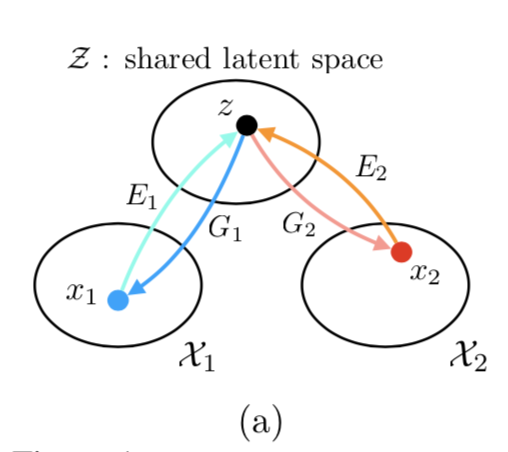
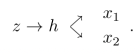
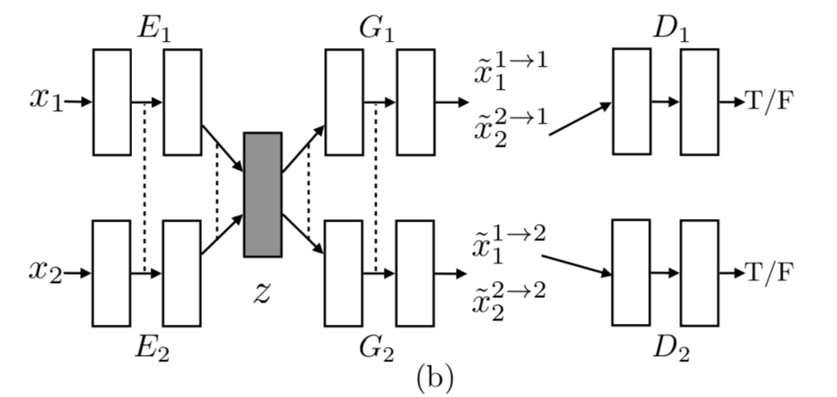
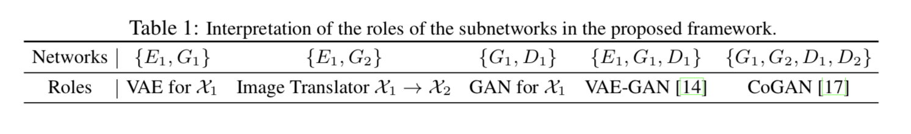
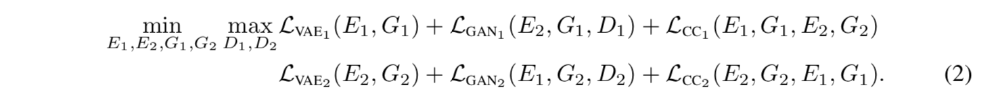
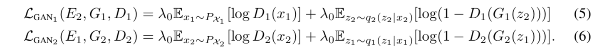
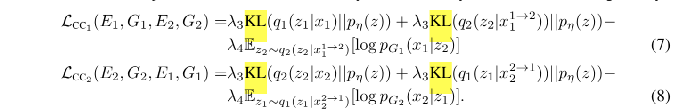
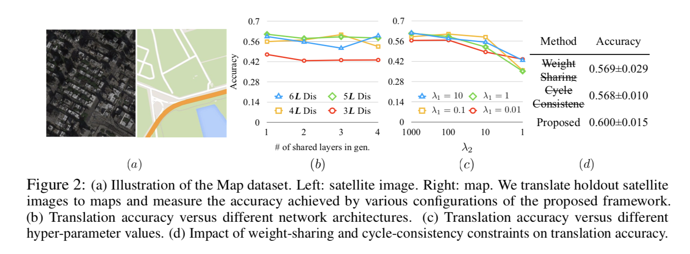
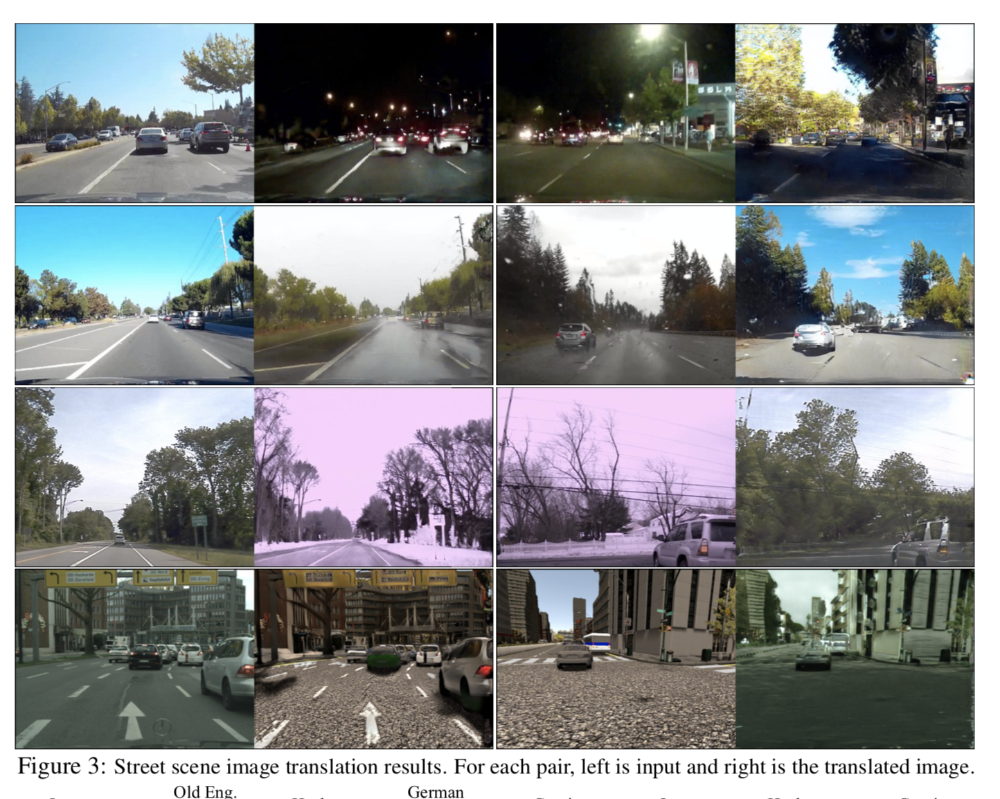
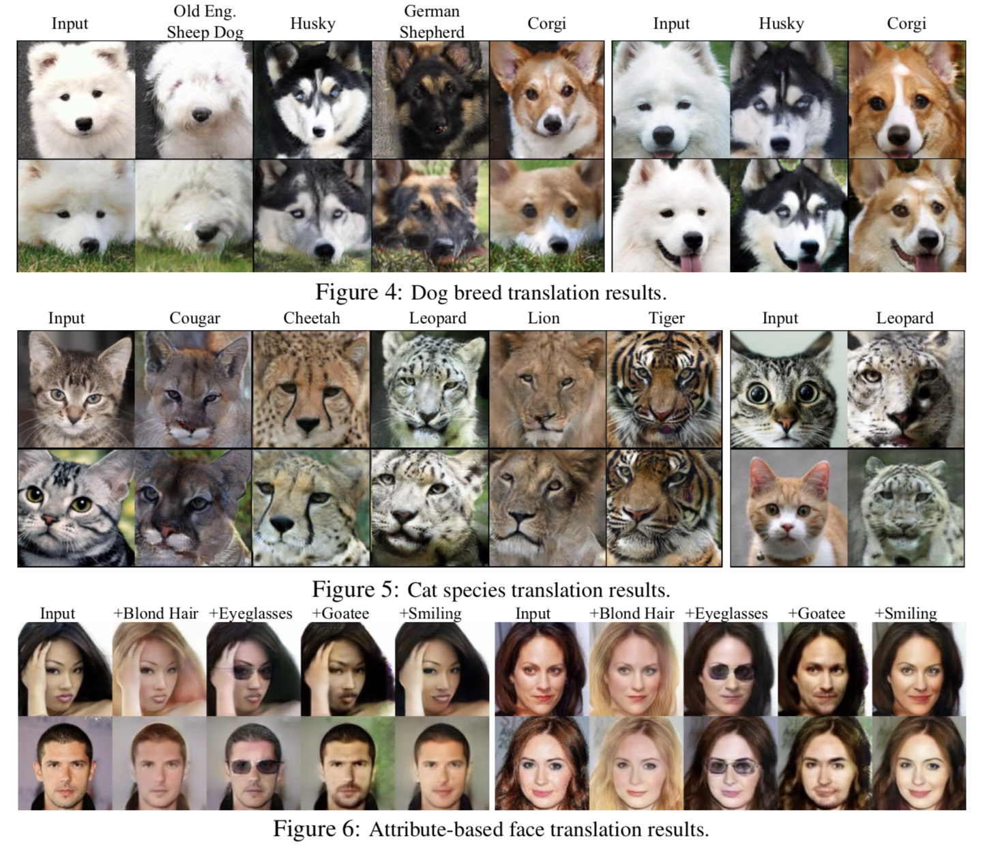

# UNIT

## Backgrounds

- image to image translation problem은 supervised learning과 unsupervised learning으로 풀 수 있다.
- 쌍으로 대응하는 이미지를 찾기 어렵기 때문에 unsupervised learning이 범용성이 높다.
- 하지만 unsupervised learning 상황에서 서로 다른 도메인에 있는 marginal distribution에서 joint distribution을 추론하기가 어렵다.(수많은 가능성이 있기 때문에)
- 이를 해결하기 위해서 shared-latent space assumption을 사용한다.

## Shared-latent space assumption

- 임의의 x1과 x2라는 이미지가 있을때 shared-latent space에 두 이미지를 복원할 수 있는 shared latent code인 z가 있다고 가정한다.

- z = E\*1(x1) = E\*2*(x2),  x1 = G\*1(z),  x2 = G\*2(z), F\*1→2(x1) = G\*2(E\*1(x1)), F\*2→1(x2) = G\*1(E\*2(x2))

- F\*1 and F\*2가 성립하기 위해서 cycle-consistency assumption이 성립할 필요가 있다.(역은 성립하지 않는다.) : x1 = F\*2→1 (F\*1→2 (x1)) , x2 = F\*1→2 (F\*2→1 (x2 )). 

- Shared-latent space를 사용하기 위해서 shared intermediate representation h를 추가적으로 가정한다.

  

- 결과적으로 밑의 식이 성립한다.

- G\*1 ≡ G\*L,1 ◦ G\*H and G\*2 ≡ G*L,2 ◦ G\*H

- G\*H 는 z에서 h를 생성하는 high level generation function이고(전체적인 것) G\*L,1과 G*L,2는 low level generation function이다.(세부적인 것) 

## Framework

- Encoder E1 E2, generator G1, G2, adversrial discriminator D1, D2 총 6개의 subnetworks로 이루어져 있다.

### VAE

- Encoder-Generator pair {E1, G1 }는 VAE를 이룬다. 
- Latent space Z는 조건부 독립이며 단위분산을 가진 가우시안분포로 가정한다. q1(z1|x1) ≡ N (z1|Eμ,1(x1), I), x ̃1→1 = G 1(z1 ∼ q1 (z1 |x1 ))
- η이라는 random vector를 활용하는 reparameterization trick을 이용하면 z1 ∼ q1(z1|x1)는 미분 가능하며 VAE를 backpropagation할 수 있다. z1 = Eμ,1(x1) + η 
### Weight-sharing

- E1과 E2의 마지막 몇개의 layer, G1과 G2의 처음 몇개의 layer에 weight-sharing을 한다.(high-level representation)
- 하지만 weight-sharing이 z가 같은 값을 가질거라는 보장은 할 수 없다.(사실 같을 수 없다.)
- 하지만  E1 and G2 functions은 F\*1→2에 E2와 G1은 F2∗→1에 수렴한다.

### GANs

- GAN1 = {D1 , G1 }, GAN2 = {D2, G2}
- G1은 두종류의 이미지를 생성할 수 있다 : x ̃2→1 = G1 (z1 ∼ q1 (z1 |x1 )), x ̃1→1 = G1(z2 ∼ q2(z2|x2)) 

### Learning

- VAE1, VAE2, GAN1,GAN2의 image reconstruction streams, the image translation streams, and the cycle-reconstruction streams를 풀어야 한다.

- 위의 negative log-likelihood를 minimize한다는 것은 이미지와 생성된 이미지의 absolute distance를 minimize함을 의미한다.

- 여태까지 보던 gan function과 동일하다.

- 두번 변환된 이미지가 input가 비슷하며 latent code가 사전확률과 다르지 않도록 한다.

## Experiment

### Domain Adaption
- 한 domain에서 학습된 classifier를 트레이닝 과정에서 볼 수 없었던 새로운 domain을 분류하는 문제에 적용.
- Source domain의 이미지를 target domain로 변형시키고 discriminator에서 뽑은 feature들로 분류한다.
- D1과 D2의 weight들을 묶었기 때문에 가능하다.
- 다른 도메인에서 생성된 이미지의 L1 norm을 minimize시킴으로서 D1과 D2 이 해당하는 이미지를 같은 방식으로 해석하도록 했다.

## Futrue Work

- Gaussian latent space assumption으로 인해 모델이 unimodal하다.
- Saddle point searching problem이 있다.
